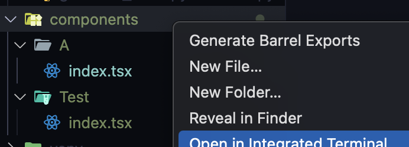
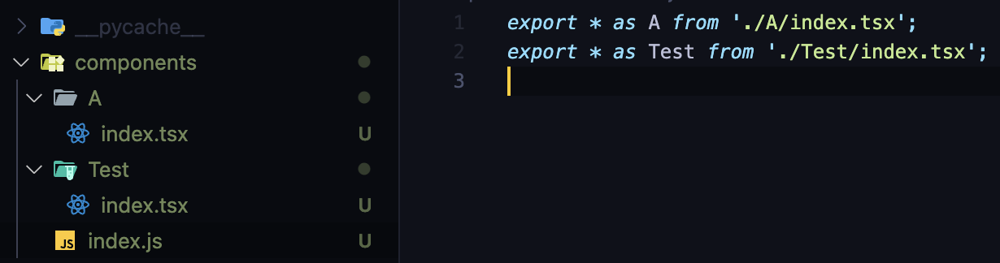
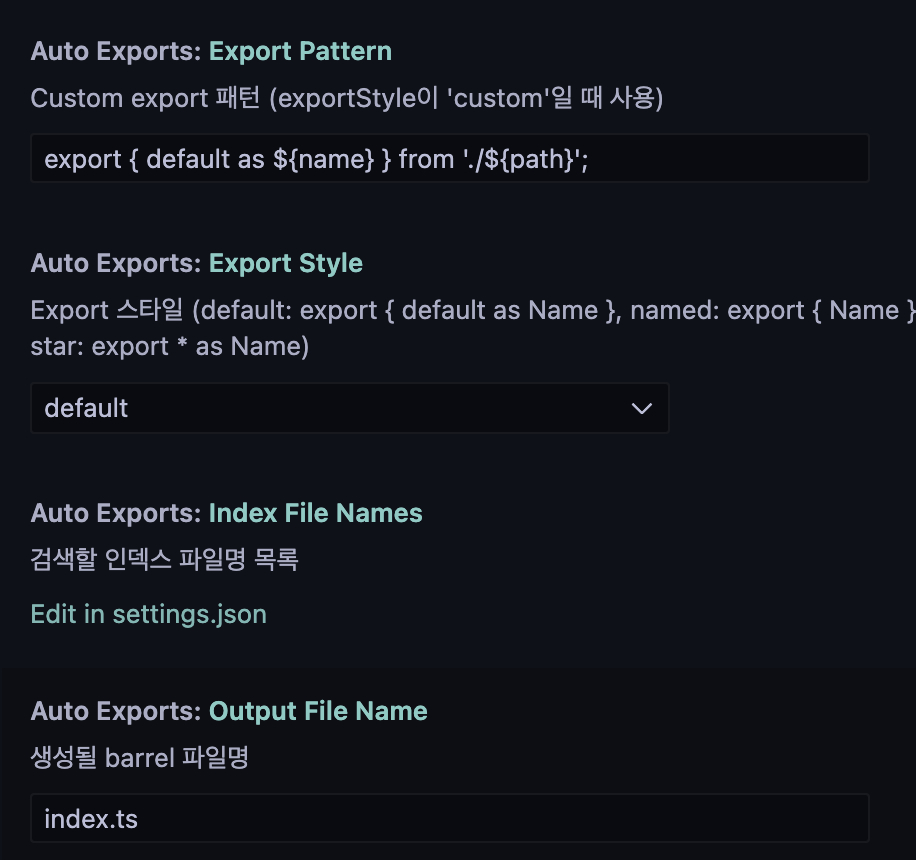

# Auto Exports

VS Code 익스텐션으로, 바렐(Barrel) 패턴의 export 구문을 자동으로 생성해주는 도구입니다.

## 기능

- 폴더 내의 컴포넌트들을 자동으로 export
- 파일 변경 감지 및 자동 업데이트
- 폴더를 우클릭하여 간단하게 barrel 파일 생성
- 다양한 export 스타일 지원
  - Default export: `export { default as Name } from './path'`
  - Named export: `export { Name } from './path'`
  - Star export: `export * as Name from './path'`
  - Custom export: 사용자 정의 패턴 지원

## 사용 방법

1. VS Code 익스플로러에서 barrel 파일을 생성하고 싶은 폴더를 우클릭하여, "Generate Barrel Exports" 메뉴를 선택합니다.
   
    
    
    
2. 설정된 스타일에 따라 자동으로 barrel 파일이 생성됩니다.
   
    
    
    
3. 파일 변경 감지 기능이 있어, 파일 변경 시 자동으로 업데이트됩니다.
    
    
    

4. vscode setting에서 (cmd + ,) 들어가서 설정을 변경할 수 있습니다.
   

Settings > Extensions > Auto Exports에서 다음 설정들을 변경할 수 있습니다:

- `autoExports.exportStyle`: export 문법 스타일 선택

  - `default`: `export { default as Name }`
  - `named`: `export { Name }`
  - `star`: `export * as Name`
  - `custom`: 사용자 정의 패턴

- `autoExports.exportPattern`: 커스텀 export 패턴
  `exportStyle`이 `custom`일 경우 사용할 패턴을 지정할 수 있습니다.
  `${name}`: 컴포넌트 이름
  `${path}`: 컴포넌트 경로
- `autoExports.indexFileNames`: 검색할 인덱스 파일명
- `autoExports.outputFileName`: 생성될 barrel 파일명

## 릴리즈 노트

### 0.0.1

초기 릴리즈

- 기본적인 barrel export 생성 기능
- 파일 시스템 감시 기능
- 다양한 export 스타일 지원

### 0.0.2

- 설명 수정

### 0.0.3

- 설명 수정
